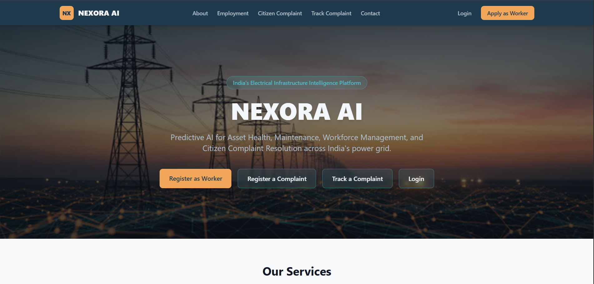
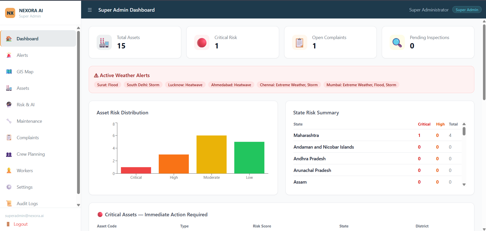
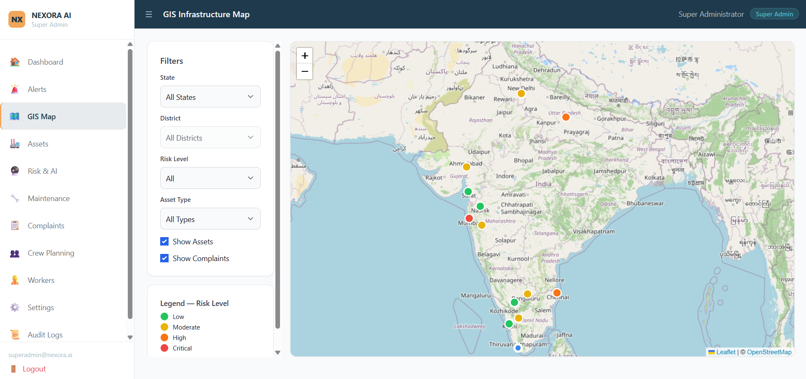

# Demo — NEXORA AI

## Demo Video

▶️ **[Watch on YouTube](https://youtu.be/eJAelIMv9rU?si=heTYxAt_r3UUx7Xi)**

`https://youtu.be/eJAelIMv9rU?si=heTYxAt_r3UUx7Xi`

---

## Live Demo

The application is not publicly deployed. To run it locally:

```bash
docker compose up -d
npm install
cp .env.example .env   # set JWT_SECRET
npm run migrate && npm run seed && npm run seed:demo
npm run dev            # backend :4000 + frontend :3000
```

Open **http://localhost:3000** — see [docs/setup-guide.md](../docs/setup-guide.md) for the full walkthrough.

---

## Screenshots

### 01 — Home / Landing Page
Public-facing landing page with citizen complaint portal, worker registration, and complaint tracking.



---

### 02 — Super Admin Dashboard
National view: KPI cards (15 assets, 1 critical risk), active weather alerts across states (Surat Flood, South Delhi Storm, Chennai Extreme Weather), Asset Risk Distribution chart, and State Risk Summary table.



---

### 03 — GIS Infrastructure Map
Leaflet map of India with all grid assets plotted as colour-coded pins (🟢 Low / 🟡 Moderate / 🟠 High / 🔴 Critical). State, district, risk level, and asset type filters. Asset + complaint layers togglable.



---

## Demo Flow (5-minute walkthrough)

| # | Step | Account | URL |
|---|------|---------|-----|
| 1 | Landing page — public portal | — | `/` |
| 2 | Login as State Admin (Gujarat) | `admin.gj@nexora.ai` / `GjAdmin@123!` | `/login` |
| 3 | Alert list — ALT-GJ-DEMO-001 | State Admin | `/state/alerts` |
| 4 | Alert detail — Overview tab | State Admin | `/state/alerts/:id` |
| 5 | Alert detail — Risk Score tab + "Ask IBM Bob" | State Admin | `/state/alerts/:id` |
| 6 | Alert detail — Assignment tab | State Admin | `/state/alerts/:id` |
| 7 | Login as Field Worker (Gujarat) | `arjun.patel@nexora.ai` / `Worker@1234!` | `/login` |
| 8 | Worker alert — findings + measurements + geo-images | Worker | `/worker/alerts/:id` |
| 9 | Super Admin dashboard + GIS map | `superadmin@nexora.ai` / `Admin@1234!` | `/admin/dashboard`, `/admin/map` |
| 10 | Maintenance priority queue | Super Admin | `/admin/maintenance` |

---

## Presentation

See [`../presentation/slides-outline.md`](../presentation/slides-outline.md) for the 9-slide deck outline.

> **Note:** Add `presentation/slides.pdf` or `presentation/slides.pptx` — the `M:\Nexora PPT` folder was empty at submission time. Export your deck and drop the file into `presentation/` then re-commit.
