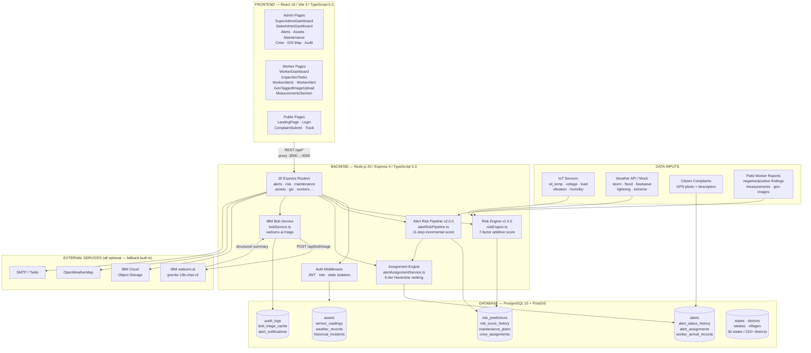

# Architecture — NEXORA AI

## Component & Data Flow Diagram



## Technology × Responsibility Table

| Technology | Version | Responsibility |
|-----------|---------|---------------|
| Node.js | 20 LTS | Backend runtime |
| TypeScript | 5.3 | Type safety across all packages |
| Express | 4.18 | HTTP routing, middleware |
| PostgreSQL | 15 | Primary data store + geographic hierarchy |
| PostGIS | 3.3 | GIS coordinate storage (`ST_Point` columns) |
| uuid-ossp | — | UUID primary keys (`uuid_generate_v4()`) |
| pgcrypto | — | Password hash verification |
| bcryptjs | 2.4 | Password hashing (rounds = 12) |
| JWT | jsonwebtoken 9 | Stateless auth tokens (8h expiry) |
| zod | 3.22 | Runtime request body validation |
| winston | 3.11 | Structured JSON logging |
| multer | 1.4 | Multipart file upload handling |
| exifr | 7.1 | EXIF GPS extraction from images |
| React | 18 | Frontend UI |
| Vite | 5 | Frontend bundler + dev server |
| Tailwind CSS | 3.4 | Utility-first styling |
| react-query | 3.39 | Server state + cache management |
| react-hook-form | 7.49 | Form state + validation |
| recharts | 2.10 | Risk history charts |
| Leaflet | 1.9 | GIS asset map |
| IBM watsonx.ai | REST API | Alert triage summaries (granite-13b-chat-v2) |
| Docker Compose | 3.9 | Local PostgreSQL + pgAdmin |

## End-to-End Data Flow

### Predictive Risk Path (Asset Health)
```
1. Sensor reading recorded → sensor_readings table
2. Weather alert seeded/ingested → weather_records table
3. Worker files inspection report → worker_observations table
4. POST /api/risk/:assetId/compute
5. riskEngine.ts pulls: asset + sensors + weather + incidents + observations
6. 7-factor score computed with named contributions
7. risk_predictions row inserted (versioned, immutable)
8. assets.current_risk_score / current_risk_level updated
9. maintenance_plans row created if risk ≥ threshold
10. State Admin sees updated Maintenance Priority Queue
```

### Alert Lifecycle Path (Incident Response)
```
1. Citizen submits complaint → complaints table
   OR State Admin creates alert → POST /api/alerts
2. alertAssignmentService ranks workers (6-tier Haversine)
3. Worker assigned → alert_assignments table → notification sent
4. Worker accepts → travels → records GPS arrival
   (mismatch check: Haversine(arrival, asset) > 200m → warning)
5. Worker records negative findings, positive findings, images, measurements
6. POST /api/alerts/:id/field-report → alert_field_reports + linked tables
7. alertRiskPipeline.ts runs 11-step delta computation
   (safety override: critical conditions floor score at 75)
8. risk_score_history row inserted
9. State Admin reviews → approve/reject/escalate/override
10. Corrective action created → worker completes → admin approves evidence
    (risk decrease ONLY after admin_approved_completion = TRUE)
11. Follow-up inspection → alert closed → final audit log entry
```

### IBM Bob Triage Path
```
1. Admin/Worker clicks "Ask IBM Bob" on Alert Detail page
2. Frontend: POST /api/bob/triage { alert_id }
3. bobService.ts assembles prompt:
   - Asset: type, location, age, current risk score
   - Negative findings: list with severity
   - Positive findings: list
   - Latest sensor readings (voltage, temperature, load, vibration)
   - Active weather alerts for district
   - Recent historical incidents (last 90 days)
4. POST to watsonx.ai /ml/v1/text/chat
   Model: ibm/granite-13b-chat-v2
5. Parse JSON response → extract summary, recommended_action, urgency_level
6. Cache in bob_triage_cache table (keyed by alert_id + content_hash)
7. Return to frontend → displayed in Risk Score tab
8. (Fallback: if WATSONX_API_KEY absent → rule-based summarizer → same shape)
```

## Database Schema Overview

| Table Group | Tables | Key relationships |
|-------------|--------|------------------|
| **Geography** | states, districts, talukas, villages | hierarchy: state→district→taluka→village |
| **Assets** | assets, asset_sensors, sensor_readings | assets belong to village + district + state |
| **Weather** | weather_records | per district, timestamped |
| **Risk** | risk_predictions, risk_score_history, maintenance_plans, crew_assignments | versioned per asset |
| **Alerts** | alerts, alert_status_history, alert_assignments, worker_arrival_records, alert_field_reports | 22-state FSM |
| **Findings** | negative_findings, positive_findings, geo_tagged_images, measurement_records | linked to field report |
| **Users** | users (super_admin, state_admin), workers | RBAC + state isolation |
| **Support** | audit_logs, notifications, alert_notifications, bob_triage_cache | full trail |

## Security & Scalability Notes

### Security
- **JWT auth** on every protected route; tokens expire in 8h; refresh required
- **State isolation at query level** — `WHERE state_id = $1` in every admin query, not just UI filtering
- **Worker isolation** — workers see only their own `alert_assignments`, `worker_arrival_records`, and `alert_field_reports`
- **Rate limiting** — 100 req/15min globally; 20 req/15min on auth endpoints
- **Helmet** — sets 12 security HTTP headers including HSTS, CSP, X-Frame-Options
- **bcrypt rounds = 12** in production (configurable via `BCRYPT_ROUNDS`)
- **No secrets in code** — all credentials via `.env`; `.env.example` ships no real values
- **Audit trail** — every alert status transition, admin approval, and override stored with actor ID + timestamp + reason

### Scalability
- **Stateless backend** — no server-side session; horizontal scaling behind a load balancer is straightforward
- **Connection pooling** — `pg.Pool` with `max: 20` connections; pool size configurable
- **IBM COS storage** — file uploads offloaded to object storage in production (local disk in dev)
- **Pagination** — all list endpoints accept `?page=&limit=` parameters
- **Modular routing** — each domain (alerts, risk, maintenance, gis…) is an independent Express Router; can be split to microservices if needed
- **Docker Compose** — single `docker compose up -d` spins up PostgreSQL 15 with PostGIS; pgAdmin included for DB inspection
